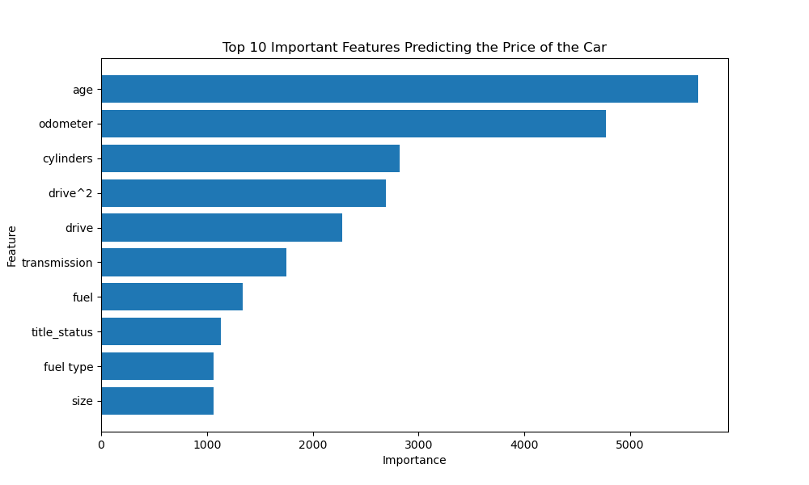

# 🚗 Automobile Price Prediction

## 📌 Project Overview
This project aims to predict the price of used automobiles using machine learning models. By analyzing historical data from Kaggle, we identify key factors that influence vehicle pricing and build predictive models to estimate car values.

## 📊 Dataset
- **Source**: Kaggle (Used Car Dataset)
- **Size**: 426,000 car listings (subset of original 3 million)
- **Features**:
  

## 🛠️ Project Workflow
### **1. Business Understanding**
- Define the objective: **Identify key drivers of car prices and develop a predictive model.**
- Understand the **business impact** of pricing strategies for dealerships.

### **2. Data Exploration & Cleaning**
- Inspect the dataset structure and check for missing values.
- Perform **data visualization** to understand relationships between variables.
- Handle missing values, remove duplicates, and normalize data.

### **3. Feature Engineering**
- Encode categorical variables using **Label Encoding & One-Hot Encoding**.
- Scale numerical features using **Z-score normalization**.
- Identify most important features using **correlation analysis & regularization techniques**.

### **4. Model Development**
We implement and compare multiple regression models:
- **Linear Regression** – Baseline model
- **Ridge Regression** – Handles multicollinearity with L2 regularization
- **Lasso Regression** – Selects important features using L1 regularization
- **Polynomial Regression with Ridge** – Captures non-linear relationships

### **5. Model Evaluation**
Models are evaluated using:
- **Root Mean Squared Error (RMSE)**
- **Cross-validation** to ensure robustness.

### **6. Insights & Recommendations**
- Identify top features affecting car price (e.g., `year`, `mileage`, `drive type`).
- Provide **actionable insights** for dealerships to improve pricing strategies.
- Deploy the best model for real-world price predictions.

## 🚀 Technologies Used
- **Python**: Data processing & modeling
- **Pandas, NumPy**: Data manipulation
- **Matplotlib, Seaborn**: Data visualization
- **Scikit-learn**: Machine learning models
- **Jupyter Notebook**: Development environment

## 📂 Project Structure

# 📌 Project Outcome
Our models indicate that the **following factors most strongly impact used car prices**:

| Rank | Feature                     | Importance Score |
|------|-----------------------------|------------------|
| 1    | **Car Age**                  | 5643.54         |
| 2    | **Odometer (Mileage)**       | 4774.41         |
| 3    | **Number of Cylinders**      | 2823.64         |
| 4    | **Drive Type² (Squared Impact)** | 2695.16   |
| 5    | **Drive Type**               | 2274.88         |
| 6    | **Transmission Type**        | 1752.26         |
| 7    | **Fuel Type**                | 1336.85         |
| 8    | **Title Status (Clean, Salvage, etc.)** | 1133.00 |
| 9    | **Detailed Fuel Type**       | 1063.22         |
| 10   | **Vehicle Size**              | 1060.68         |

Following image shows the **feature importance** by the above dimensions:

### Insights  
- **Newer cars** tend to have **higher prices**, with **age** being the most critical factor.  
- **Mileage (Odometer)** strongly influences pricing—lower mileage increases resale value.  
- **Transmission & drive type** significantly impact price, with **automatic transmissions** and **4WD/AWD** commanding higher values.  
- **Fuel type & engine cylinders** play a role, where larger engines tend to be priced higher.  
- **Title status** (clean vs. salvage) can heavily impact resale value.  

### Business Recommendations for Used Car Sales
1. **Target Low-Mileage Vehicles** – Cars with **lower odometer readings** hold better value.
2. **Prioritize Newer Models** – **Depreciation slows down** after a few years, making 3-5 year-old cars a sweet spot for resale.
3. **Highlight Transmission & Drive Type** – Automatic & AWD vehicles tend to **sell faster** and at **higher prices**.
4. **Consider Engine Specs** – Vehicles with more **cylinders** and **larger sizes** appeal to certain buyers.
5. **Verify Title Status** – A **clean title** adds significant resale value.  

